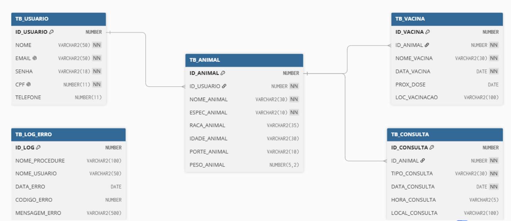
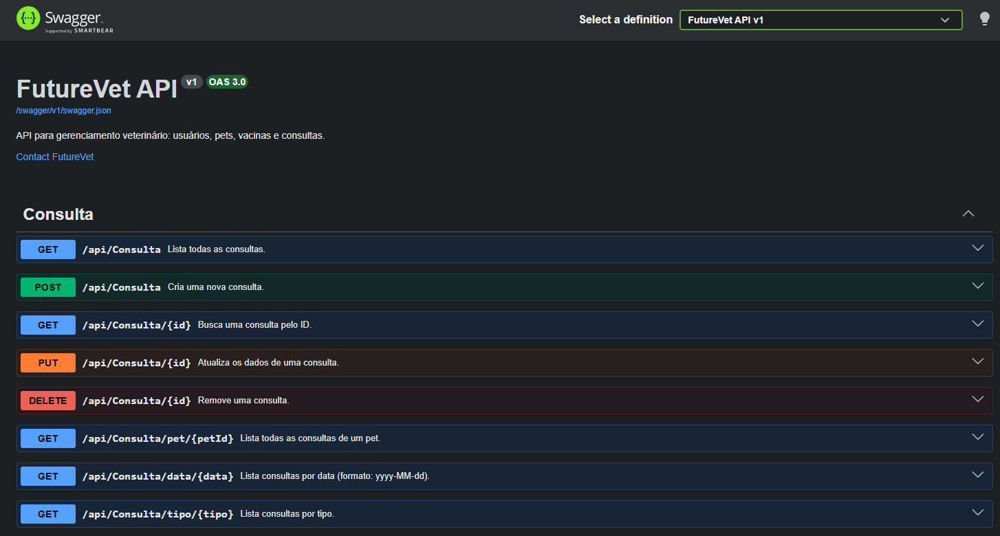
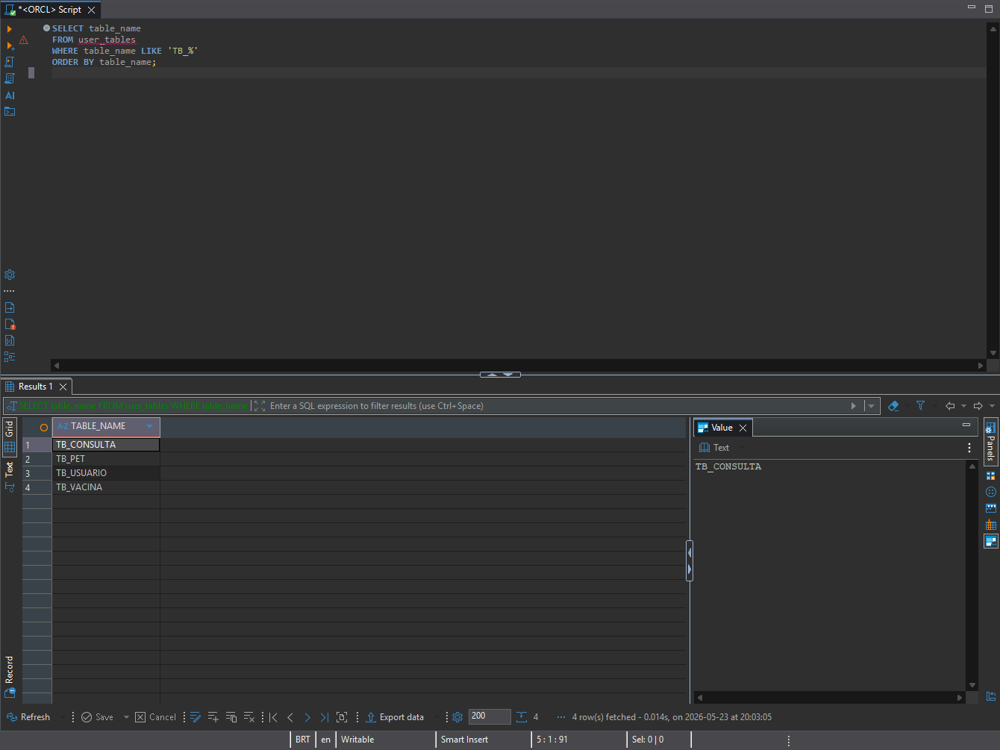

# 🐾 FutureVet

Sistema para gerenciamento veterinário de **pets**, permitindo que donos cadastrem seus animais, acompanhem **vacinas** e **consultas** de forma organizada.

## 🎯 Objetivo

O projeto **FutureVet** foi desenvolvido com o objetivo de criar uma plataforma onde donos de pets possam:

* 🐶 cadastrar e gerenciar seus pets
* 💉 registrar e acompanhar o histórico de vacinas
* 🩺 agendar e consultar histórico de consultas veterinárias
* 👤 gerenciar perfis de usuário

O sistema facilita o controle da saúde animal e garante que nenhuma vacina ou consulta seja esquecida.

---

# 🏗️ Arquitetura

O projeto segue princípios de **Domain-Driven Design (DDD)** e separação de responsabilidades em camadas.

Estrutura principal:

```
FutureVet
│
├── FutureVet.Domain
│   ├── Entities
│   ├── Enums
│   ├── Common
│   └── Exceptions
│
├── FutureVet.Application
│   ├── DTOs
│   ├── Interfaces
│   │   ├── Repositories
│   │   └── Services
│   └── Services
│
├── FutureVet.Infrastructure
│   └── Persistence
│       ├── Configurations
│       ├── Migrations
│       └── Repositories
│
└── FutureVet.API
    └── Controllers
```

---

# 🗂️ Modelo Entidade-Relacionamento (MER)

O banco de dados foi modelado contendo as seguintes entidades principais:

* Usuario
* Pet
* Vacina
* Consulta

### MER


### Principais relacionamentos

* **Usuario 1:N Pet**
* **Pet 1:N Vacina**
* **Pet 1:N Consulta**

---

# 🧩 Entidades do Domínio

## Usuario

Representa o dono dos pets cadastrados na plataforma.

Atributos principais:

* Nome
* Email
* Senha
* Cpf
* Telefone

Relacionamentos:

* um usuário pode ter **múltiplos pets**

---

## Pet

Representa o animal de estimação cadastrado por um usuário.

Atributos principais:

* NomePet
* Especie (Cão, Gato, Coelho, Outro)
* Raca
* Idade
* Tamanho (Pequeno, Médio, Grande)
* Peso

Relacionamentos:

* pertence a um **Usuario**
* possui **múltiplas vacinas**
* possui **múltiplas consultas**

---

## Vacina

Representa o registro de vacinação de um pet.

Atributos:

* NomeVacina
* DataAplicacao
* ProximaDose
* LocalAplicacao

Relacionamento:

* pertence a um **Pet**

---

## Consulta

Representa uma consulta veterinária agendada ou realizada.

Atributos:

* TipoConsulta
* Data
* Hora
* Local

Relacionamento:

* pertence a um **Pet**

---

# 🛠️ Tecnologias Utilizadas

* C#
* .NET 10
* ASP.NET Core (Controllers)
* Entity Framework Core 10
* Domain-Driven Design (DDD)
* Oracle Database
* Swagger / OpenAPI
* Git / GitHub

---

# 📊 Regras de Negócio

Algumas regras implementadas no domínio:

* senha do usuário deve ter **mínimo de 8 caracteres**
* e-mail deve conter **@** para ser válido
* CPF é **único** por usuário
* peso do pet deve ser **maior que zero**
* idade do pet deve ser **maior ou igual a zero**
* próxima dose da vacina não pode ser **anterior à data de aplicação**
* hora da consulta deve estar no formato **HH:mm**

---

# 🗄️ Implementação com EF Core

## SGBD utilizado
**Oracle** (`oracle.fiap.com.br`) via provider `Oracle.EntityFrameworkCore`

## O que foi implementado

* `DbContext` (`FutureVetContext`) na camada **Infrastructure** com todas as 4 entidades
* Mapeamento completo via **Fluent API** (`IEntityTypeConfiguration<T>`) para cada entidade
* Relacionamentos com cascata configurados (Pet → Vacinas, Pet → Consultas)
* Índices únicos em Email e CPF do usuário
* **Migration** (`InitialCreate`) gerada e aplicada com sucesso
* Repositórios com interfaces na **Application** e implementações na **Infrastructure**:
  * `IUsuarioRepository` / `UsuarioRepository`
  * `IPetRepository` / `PetRepository`
  * `IVacinaRepository` / `VacinaRepository`
  * `IConsultaRepository` / `ConsultaRepository`
* Injeção de dependência registrada no `Program.cs`
* Controllers com endpoints CRUD completos e rotas parametrizadas

---

# 🚀 Como Executar

## Pré-requisitos

* [.NET 10 SDK](https://dotnet.microsoft.com/download)

## 1. Clonar o repositório

```bash
git clone https://github.com/seu-usuario/FutureVet.git
cd FutureVet
```

## 2. Configurar credenciais

Crie ou edite o arquivo `FutureVet.API/appsettings.Development.json` com suas credenciais:

```json
{
  "ConnectionStrings": {
    "OracleConnection": "User Id=SEU_RM;Password=SUA_SENHA;Data Source=oracle.fiap.com.br:1521/ORCL"
  }
}
```

## 3. Aplicar as migrations

```bash
dotnet ef database update --project FutureVet.Infrastructure --startup-project FutureVet.API
```

## 4. Rodar a API

```bash
dotnet run --project FutureVet.API
```

A documentação interativa estará disponível em:

```
http://localhost:5000
```

---

# 📋 Rotas da API

### Usuario — `/api/usuario`

| Método | Rota | Descrição | Status |
|--------|------|-----------|--------|
| GET | `/api/usuario` | Lista todos os usuários | 200 |
| GET | `/api/usuario/{id}` | Busca usuário por ID | 200 / 404 |
| GET | `/api/usuario/email/{email}` | Busca usuário por e-mail | 200 / 400 / 404 |
| GET | `/api/usuario/nome/{nome}` | Busca usuários por nome (parcial) | 200 / 400 |
| POST | `/api/usuario` | Cria um novo usuário | 201 / 400 |
| PUT | `/api/usuario/{id}` | Atualiza nome e telefone | 204 / 400 / 404 |
| DELETE | `/api/usuario/{id}` | Remove um usuário | 204 / 404 |

### Pet — `/api/pet`

| Método | Rota | Descrição | Status |
|--------|------|-----------|--------|
| GET | `/api/pet` | Lista todos os pets | 200 |
| GET | `/api/pet/{id}` | Busca pet por ID | 200 / 404 |
| GET | `/api/pet/nome/{nome}` | Busca pets por nome (parcial) | 200 / 400 |
| GET | `/api/pet/especie/{especie}` | Busca pets por espécie (1=Cão, 2=Gato, 3=Coelho, 4=Outro) | 200 / 400 |
| GET | `/api/pet/usuario/{usuarioId}` | Lista todos os pets de um usuário | 200 |
| POST | `/api/pet` | Cria um novo pet | 201 / 400 |
| PUT | `/api/pet/{id}` | Atualiza dados do pet | 204 / 400 / 404 |
| DELETE | `/api/pet/{id}` | Remove um pet | 204 / 404 |

### Vacina — `/api/vacina`

| Método | Rota | Descrição | Status |
|--------|------|-----------|--------|
| GET | `/api/vacina` | Lista todas as vacinas | 200 |
| GET | `/api/vacina/{id}` | Busca vacina por ID | 200 / 404 |
| GET | `/api/vacina/pet/{petId}` | Lista vacinas de um pet | 200 |
| GET | `/api/vacina/proxima-dose/{data}` | Vacinas com próxima dose até a data (yyyy-MM-dd) | 200 / 400 |
| POST | `/api/vacina` | Registra uma nova vacina | 201 / 400 |
| PUT | `/api/vacina/{id}` | Atualiza próxima dose e local | 204 / 400 / 404 |
| DELETE | `/api/vacina/{id}` | Remove uma vacina | 204 / 404 |

### Consulta — `/api/consulta`

| Método | Rota | Descrição | Status |
|--------|------|-----------|--------|
| GET | `/api/consulta` | Lista todas as consultas | 200 |
| GET | `/api/consulta/{id}` | Busca consulta por ID | 200 / 404 |
| GET | `/api/consulta/pet/{petId}` | Lista consultas de um pet | 200 |
| GET | `/api/consulta/data/{data}` | Lista consultas por data (yyyy-MM-dd) | 200 / 400 |
| GET | `/api/consulta/tipo/{tipo}` | Lista consultas por tipo | 200 / 400 |
| POST | `/api/consulta` | Agenda uma nova consulta | 201 / 400 |
| PUT | `/api/consulta/{id}` | Atualiza dados da consulta | 204 / 400 / 404 |
| DELETE | `/api/consulta/{id}` | Remove uma consulta | 204 / 404 |

---

# 📦 Exemplos de Corpo (POST)

### Criar usuário
```json
{
  "nome": "João Silva",
  "email": "joao@email.com",
  "senha": "senha123",
  "cpf": "12345678901",
  "telefone": "11999999999"
}
```

### Criar pet
```json
{
  "nomePet": "Rex",
  "especie": 1,
  "raca": "Labrador",
  "idade": 3,
  "tamanho": 3,
  "peso": 28.5,
  "usuarioId": "00000000-0000-0000-0000-000000000000"
}
```

### Registrar vacina
```json
{
  "nomeVacina": "V10",
  "dataAplicacao": "2025-01-10T00:00:00",
  "proximaDose": "2026-01-10T00:00:00",
  "localAplicacao": "Clínica VetCare",
  "petId": "00000000-0000-0000-0000-000000000000"
}
```

### Agendar consulta
```json
{
  "tipoConsulta": "Rotina",
  "data": "2025-06-01T00:00:00",
  "hora": "14:30",
  "local": "Clínica VetCare",
  "petId": "00000000-0000-0000-0000-000000000000"
}
```

---

# 🗄️ Banco de Dados

As tabelas são criadas via migrations do EF Core:

| Tabela | Descrição |
|--------|-----------|
| `TB_USUARIO` | Dados dos donos dos pets |
| `TB_PET` | Dados dos pets (FK → TB_USUARIO) |
| `TB_VACINA` | Histórico de vacinas (FK → TB_PET) |
| `TB_CONSULTA` | Consultas veterinárias (FK → TB_PET) |

---

# 📊 Evidências

### Swagger


### Esquema no banco Oracle


---

# 👥 Autores

* Ryan Vetoriano | RM 565667
* João Victor Caetano Alves da Silva | RM 562074
* João Victor Bueno Castelini da Silva | RM 564115
* Raul Rezende Iemini Aguiar | RM 564002
* Felipe Furlanetto | RM 562766
