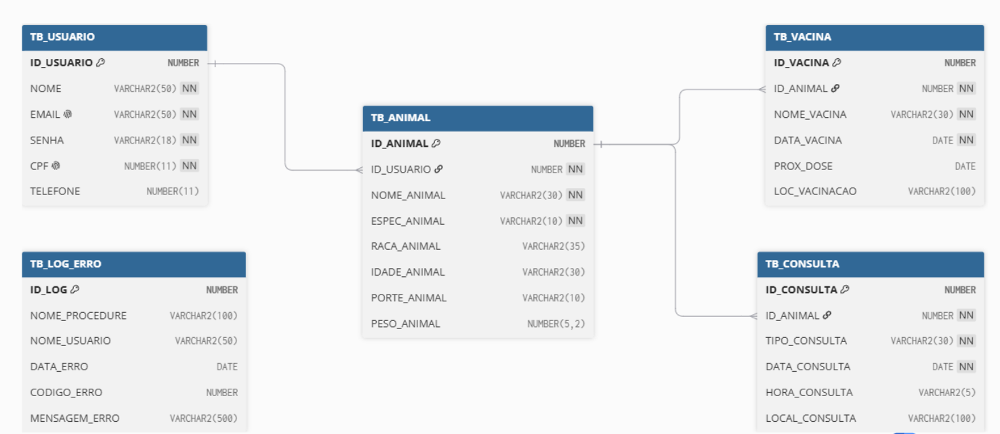
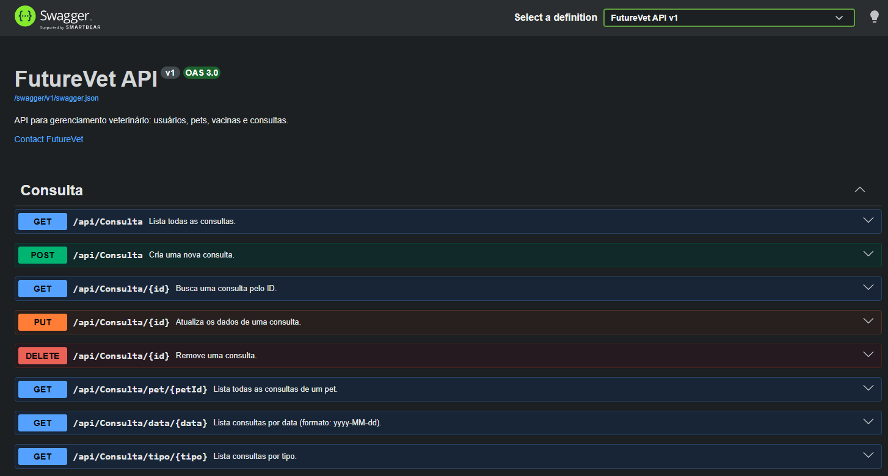
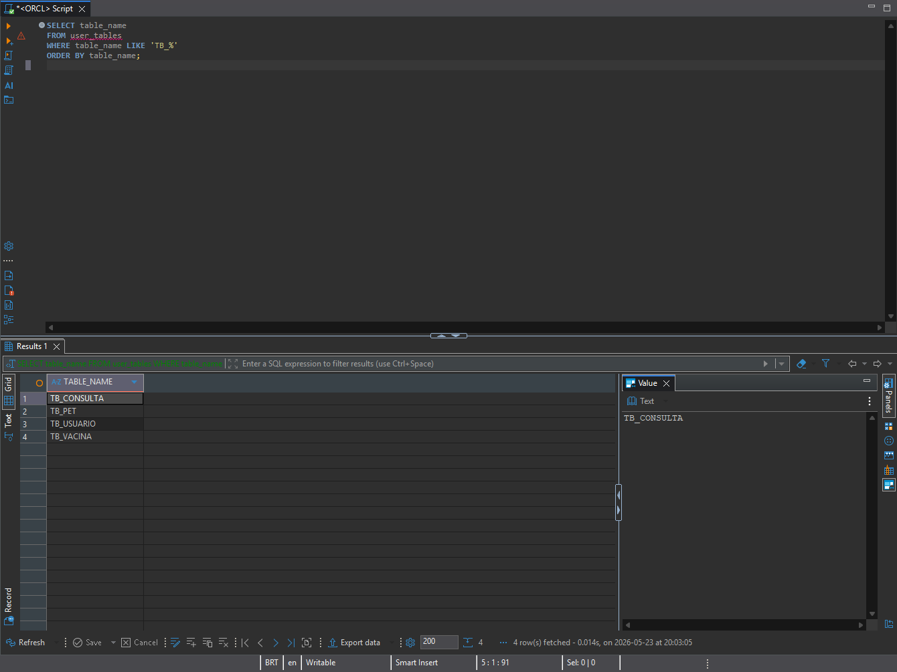
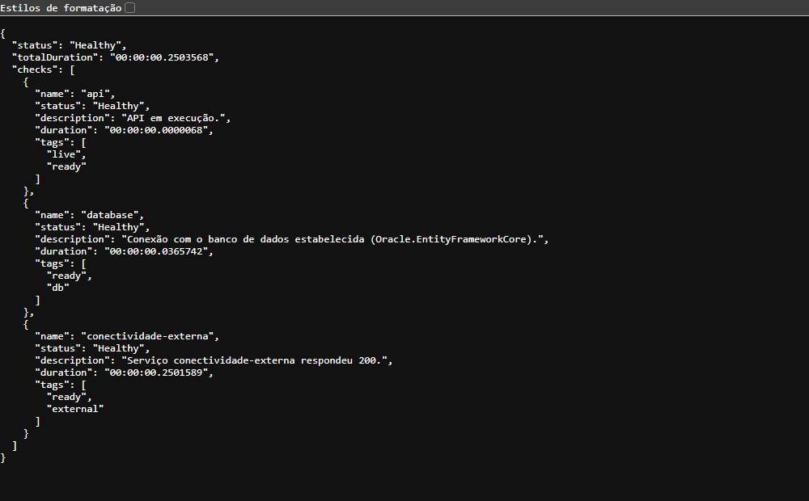
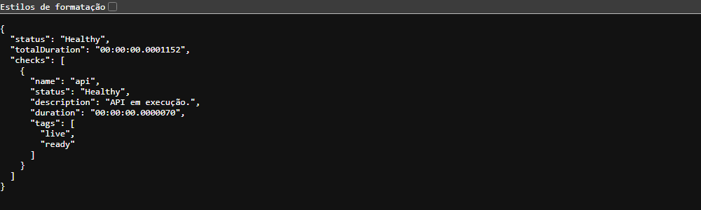
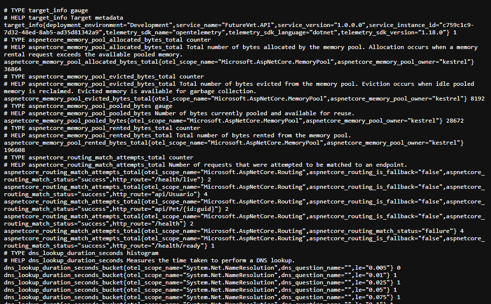
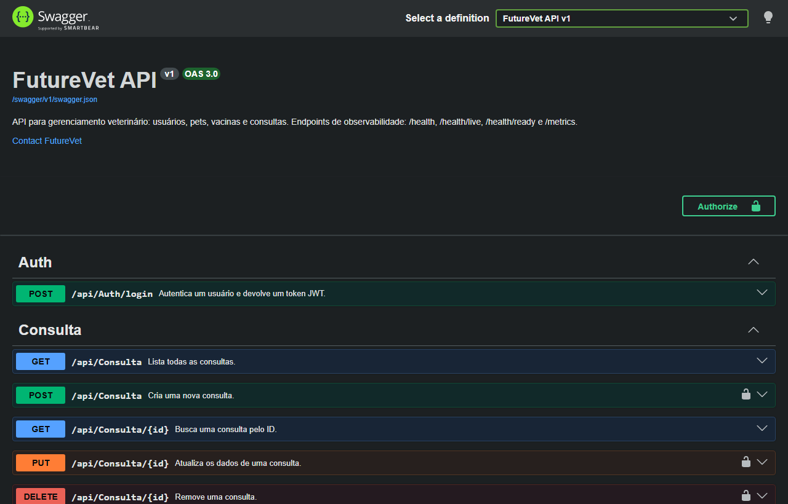

# 🐾 FutureVet

Sistema para gerenciamento veterinário de **pets**, permitindo que donos cadastrem seus animais, acompanhem **vacinas** e **consultas** de forma organizada.

## 🎯 Objetivo

O projeto **FutureVet** foi desenvolvido com o objetivo de criar uma plataforma onde donos de pets possam:

* 🐶 cadastrar e gerenciar seus pets
* 💉 registrar e acompanhar o histórico de vacinas
* 🩺 agendar e consultar histórico de consultas veterinárias
* 👤 gerenciar perfis de usuário

O sistema facilita o controle da saúde animal e garante que nenhuma vacina ou consulta seja esquecida.

Além das funcionalidades de negócio, a aplicação foi preparada para operar em produção com
**monitoramento e observabilidade completos** e é coberta por uma **suíte de testes automatizados**:

* ❤️ **Health checks** (`/health`, `/health/live`, `/health/ready`) com verificação real de conectividade
* 📝 **Logging estruturado** com Serilog (console + arquivo com rotação diária)
* 🔗 **Correlation ID** por requisição (`X-Correlation-ID`), propagado para todos os logs
* 🔭 **Tracing distribuído** com OpenTelemetry (ASP.NET Core, HttpClient, EF Core e camada de Application)
* 📈 **Métricas** expostas em `/metrics` no formato Prometheus
* 🧪 **Testes unitários e de integração** em xUnit, organizados no padrão AAA
* 🛡️ **Tratamento global de erros** padronizado em ProblemDetails (RFC 9457)
* 🔐 **Autenticação JWT** protegendo as operações de escrita

---

# 🧭 Guia de Avaliação

Onde cada critério das sprints está implementado e como verificá-lo.

### Sprint 1 — CRUD, HTTP, Oracle e OpenAPI

| Critério | Onde está | Como verificar |
|---|---|---|
| GET com mais de 3 rotas parametrizadas | **14 rotas** nos 4 controllers | [Rotas da API](#-rotas-da-api) |
| POST, PUT, DELETE | 1 de cada nos 4 controllers | Swagger |
| Organização REST | `api/[controller]` + sub-recursos (`/pet/{petId}`) | [Rotas da API](#-rotas-da-api) |
| 200 / 201 / 204 / 400 / 404 / 401 | `ProducesResponseType` em todas as ações | 111 testes de integração |
| DbContext | `FutureVet.Infrastructure/Persistence/FutureVetContext.cs` | — |
| Mapeamento das entidades | `Persistence/Configurations/*.cs` (Fluent API) | — |
| Conexão com Oracle | `GET /health` → check `database` | [Evidências](#-evidências) |
| Migrations | `Migrations/20260523230247_InitialCreate` | `dotnet ef database update` |
| Estrutura do banco | FKs em cascata + índices únicos (Email, CPF) | [Banco de Dados](#-banco-de-dados) |
| Swagger configurado | Interface na raiz (`http://localhost:5189`) | [Evidências](#-evidências) |
| Endpoints documentados | XML comments → **18 rotas** no OpenAPI | Swagger |
| README | este arquivo | — |

### Sprint 3 — Observabilidade e testes

| Critério | Pts | Onde está |
|---|---|---|
| Health Checks | 15 | `FutureVet.API/HealthChecks/` e `Extensions/HealthCheckExtensions.cs` |
| Logging estruturado (Serilog + correlação) | 10 | `Extensions/LoggingExtensions.cs`, `Middleware/CorrelationIdMiddleware.cs` |
| Tracing e métricas (OpenTelemetry) | 15 | `Extensions/OpenTelemetryExtensions.cs`, `Application/Observability/` |
| Testes unitários (xUnit + Moq, AAA) | 20 | `tests/FutureVet.UnitTests/` — **95 testes** |
| Testes de integração (WebApplicationFactory) | 15 | `tests/FutureVet.IntegrationTests/` — **111 testes** |
| Cobertura, nomenclatura, Fixtures | 15 | [Testes](#-testes) |
| README | 10 | este arquivo |

### Verificação em 3 comandos

```bash
dotnet test
```

```bash
dotnet run --project FutureVet.API
```

Com a API no ar: Swagger em `http://localhost:5189`, e `/health`, `/health/ready` e `/metrics`
respondendo sem autenticação.

> Para testar `POST`, `PUT` e `DELETE` no Swagger, cadastre-se em `POST /api/usuario`
> (público), autentique-se em `POST /api/auth/login` e clique em **Authorize** com o token.
> Os `GET` funcionam sem isso. Detalhes em [Autenticação](#-autenticação).

---

# 🏗️ Arquitetura

O projeto segue princípios de **Domain-Driven Design (DDD)** e separação de responsabilidades em camadas.

Estrutura principal:

```
FutureVet
│
├── FutureVet.Domain
│   ├── Entities
│   ├── Enums
│   ├── Common
│   └── Exceptions
│
├── FutureVet.Application
│   ├── DTOs
│   ├── Interfaces
│   │   ├── Repositories
│   │   └── Services
│   └── Services
│
├── FutureVet.Infrastructure
│   └── Persistence
│       ├── Configurations
│       ├── Migrations
│       └── Repositories
│
├── FutureVet.API
│   ├── Controllers
│   ├── Auth               # JwtOptions e emissão do token JWT
│   ├── Errors             # tratamento global de exceções (ProblemDetails)
│   ├── Extensions         # AddApplicationHealthChecks, AddSerilogLogging, AddOpenTelemetryConfiguration
│   ├── HealthChecks       # checks de banco e de serviços externos + writer JSON
│   └── Middleware         # CorrelationIdMiddleware
│
└── tests
    ├── FutureVet.UnitTests         # Domain + Application (xUnit + Moq)
    └── FutureVet.IntegrationTests  # API completa (WebApplicationFactory)
```

---

# 🗂️ Modelo Entidade-Relacionamento (MER)

O banco de dados foi modelado contendo as seguintes entidades principais:

* Usuario
* Pet
* Vacina
* Consulta

### MER


### Principais relacionamentos

* **Usuario 1:N Pet**
* **Pet 1:N Vacina**
* **Pet 1:N Consulta**

---

# 🧩 Entidades do Domínio

## Usuario

Representa o dono dos pets cadastrados na plataforma.

Atributos principais:

* Nome
* Email
* Senha
* Cpf
* Telefone

Relacionamentos:

* um usuário pode ter **múltiplos pets**

---

## Pet

Representa o animal de estimação cadastrado por um usuário.

Atributos principais:

* NomePet
* Especie (Cão, Gato, Coelho, Outro)
* Raca
* Idade
* Tamanho (Pequeno, Médio, Grande)
* Peso

Relacionamentos:

* pertence a um **Usuario**
* possui **múltiplas vacinas**
* possui **múltiplas consultas**

---

## Vacina

Representa o registro de vacinação de um pet.

Atributos:

* NomeVacina
* DataAplicacao
* ProximaDose
* LocalAplicacao

Relacionamento:

* pertence a um **Pet**

---

## Consulta

Representa uma consulta veterinária agendada ou realizada.

Atributos:

* TipoConsulta
* Data
* Hora
* Local

Relacionamento:

* pertence a um **Pet**

---

# 🛠️ Tecnologias Utilizadas

* C#
* .NET 10
* ASP.NET Core (Controllers)
* Entity Framework Core 10
* Domain-Driven Design (DDD)
* Oracle Database
* Swagger / OpenAPI
* JWT Bearer (autenticação)
* Serilog (logging estruturado)
* OpenTelemetry (tracing distribuído e métricas)
* Prometheus (formato de exposição das métricas)
* xUnit, Moq e coverlet (testes e cobertura)
* Git / GitHub

---

# 📊 Regras de Negócio

Algumas regras implementadas no domínio:

* senha do usuário deve ter **mínimo de 8 caracteres**
* e-mail deve conter **@** para ser válido
* CPF é **único** por usuário
* peso do pet deve ser **maior que zero**
* idade do pet deve ser **maior ou igual a zero**
* próxima dose da vacina não pode ser **anterior à data de aplicação**
* hora da consulta deve estar no formato **HH:mm**
* operações de **escrita** exigem um token JWT válido; leitura e cadastro são públicos

---

# 🗄️ Implementação com EF Core

## SGBD utilizado
**Oracle** (`oracle.fiap.com.br`) via provider `Oracle.EntityFrameworkCore`

## O que foi implementado

* `DbContext` (`FutureVetContext`) na camada **Infrastructure** com todas as 4 entidades
* Mapeamento completo via **Fluent API** (`IEntityTypeConfiguration<T>`) para cada entidade
* Relacionamentos com cascata configurados (Pet → Vacinas, Pet → Consultas)
* Índices únicos em Email e CPF do usuário
* **Migration** (`InitialCreate`) gerada e aplicada com sucesso
* Repositórios com interfaces na **Application** e implementações na **Infrastructure**:
  * `IUsuarioRepository` / `UsuarioRepository`
  * `IPetRepository` / `PetRepository`
  * `IVacinaRepository` / `VacinaRepository`
  * `IConsultaRepository` / `ConsultaRepository`
* Injeção de dependência registrada no `Program.cs`
* Controllers com endpoints CRUD completos e rotas parametrizadas

---

# 🚀 Como Executar

## Pré-requisitos

* [.NET 10 SDK](https://dotnet.microsoft.com/download)

## 1. Clonar o repositório

```bash
git clone https://github.com/seu-usuario/FutureVet.git
cd FutureVet
```

## 2. Configurar credenciais

Crie ou edite o arquivo `FutureVet.API/appsettings.Development.json` com suas credenciais:

```json
{
  "ConnectionStrings": {
    "OracleConnection": "User Id=SEU_RM;Password=SUA_SENHA;Data Source=oracle.fiap.com.br:1521/ORCL"
  }
}
```

> ⚠️ **Nenhum segredo é versionado.** `appsettings.Development.json` está no `.gitignore`;
> o `appsettings.json` do repositório contém apenas *placeholders*. Em outros ambientes,
> prefira variáveis de ambiente
> (`ConnectionStrings__OracleConnection=...`) ou User Secrets:
>
> ```bash
> dotnet user-secrets set "ConnectionStrings:OracleConnection" "..." --project FutureVet.API
> ```

### Chave de assinatura do JWT

Em **Development**, a API sobe mesmo sem a chave: uma chave efêmera é gerada por execução e
um aviso aparece no log — assim quem acabou de clonar o repositório consegue rodar de imediato.
Como a chave muda a cada reinício, os tokens emitidos deixam de valer quando a API é reiniciada.

Para uma chave estável (e obrigatória fora de Development), gere 32+ bytes aleatórios e guarde
em User Secrets:

```bash
dotnet user-secrets set "Jwt:SigningKey" "$(openssl rand -base64 48)" --project FutureVet.API
```

No Windows PowerShell, sem o `openssl`:

```bash
dotnet user-secrets set "Jwt:SigningKey" "$([Convert]::ToBase64String((1..48|%{Get-Random -Max 256})))" --project FutureVet.API
```

### Arquivos de configuração

| Arquivo | Uso |
|---------|-----|
| `appsettings.json` | Base: Serilog (console + arquivo), OpenTelemetry, health checks e JWT (Issuer/Audience/expiração). **Sem segredos** |
| `appsettings.Development.json` | Credenciais locais. **Não versionado** |
| `appsettings.Testing.json` | Ambiente usado pelos testes de integração: sem dependências externas |

## 3. Aplicar as migrations

```bash
dotnet ef database update --project FutureVet.Infrastructure --startup-project FutureVet.API
```

## 4. Restaurar, compilar e rodar a API

```bash
dotnet restore
```

```bash
dotnet build
```

```bash
dotnet run --project FutureVet.API
```

A documentação interativa (Swagger) fica na raiz da aplicação:

```
http://localhost:5189
```

Endpoints de observabilidade disponíveis assim que a API sobe:

```
GET http://localhost:5189/health
GET http://localhost:5189/health/live
GET http://localhost:5189/health/ready
GET http://localhost:5189/metrics
```

## 5. Configurar o Oracle usado pelos testes

Os testes de integração rodam contra **Oracle** — o mesmo SGBD de produção, sem banco
substituto. Informe a connection string ao projeto de testes com **User Secrets**, que grava
fora do repositório (`%APPDATA%\Microsoft\UserSecrets` no Windows,
`~/.microsoft/usersecrets` no Linux/macOS):

```bash
dotnet user-secrets set "ConnectionStrings:OracleConnection" "User Id=SEU_RM;Password=SUA_SENHA;Data Source=oracle.fiap.com.br:1521/ORCL" --project tests/FutureVet.IntegrationTests
```

Alternativamente, via variável de ambiente:

```bash
ConnectionStrings__OracleConnection="User Id=SEU_RM;Password=SUA_SENHA;Data Source=oracle.fiap.com.br:1521/ORCL"
```

O schema precisa estar aplicado (passo 3). Sem a connection string, os testes de integração
falham com uma mensagem explicando exatamente o que configurar — eles **não são silenciados
nem ignorados**.

## 6. Executar os testes

```bash
dotnet test
```

```bash
dotnet test --collect:"XPlat Code Coverage"
```

---

# 🔐 Autenticação

A API usa **JWT Bearer**. Fluxo:

1. Cadastre-se em `POST /api/usuario` (público);
2. Autentique-se em `POST /api/auth/login` com e-mail e senha;
3. Envie o token nas operações de escrita: `Authorization: Bearer <token>`.

No Swagger, use o botão **Authorize** e cole apenas o token.

### O que é público e o que é protegido

| Operação | Acesso |
|---|---|
| `POST /api/auth/login` | Público |
| `POST /api/usuario` (cadastro) | Público — é o ponto de entrada, sem ele não haveria como obter um token |
| **Todos os `GET`** | Público (leitura) |
| `PUT` e `DELETE` de usuário | **Requer token** |
| `POST`, `PUT` e `DELETE` de pet, vacina e consulta | **Requer token** |
| `/health`, `/health/live`, `/health/ready`, `/metrics` | Público — sondas e o Prometheus não enviam token |

### Exemplo

```bash
curl -X POST http://localhost:5189/api/auth/login -H "Content-Type: application/json" -d "{\"email\":\"joao@email.com\",\"senha\":\"senha123\"}"
```

Resposta:

```json
{
  "id": "3f2b...",
  "nome": "João Silva",
  "email": "joao@email.com",
  "token": "eyJhbGciOiJIUzI1NiIsInR5cCI6IkpXVCJ9...",
  "expiraEm": "2026-09-11T18:30:00Z"
}
```

### Configuração da chave de assinatura

A chave **nunca é versionada**. O `appsettings.json` traz apenas `Issuer`, `Audience` e
`ExpiracaoEmMinutos`. Defina a chave (mínimo de 32 bytes) por User Secrets:

```bash
dotnet user-secrets set "Jwt:SigningKey" "<chave aleatoria de 32+ bytes>" --project FutureVet.API
```

ou pela variável de ambiente `Jwt__SigningKey`.

| Ambiente | Sem a chave configurada |
|---|---|
| `Development` | Sobe normalmente com uma **chave efêmera** gerada por execução, registrando um `Warning`. Os tokens não sobrevivem a um reinício |
| Qualquer outro | **Não sobe.** Falha na inicialização com uma mensagem explicando o que configurar, em vez de emitir tokens assinados com uma chave ausente ou improvisada |

> ⚠️ **Limitação conhecida:** a senha do usuário é armazenada em **texto puro**, como
> modelado nas sprints anteriores. O login faz a comparação em tempo constante
> (`Usuario.SenhaCorresponde`), mas a evolução necessária é guardar apenas o hash
> (PBKDF2 ou BCrypt). Isso exigiria uma migration e a reescrita das senhas existentes.

---

# 📋 Rotas da API

> 🔒 = exige `Authorization: Bearer <token>`

### Auth — `/api/auth`

| Método | Rota | Descrição | Status |
|--------|------|-----------|--------|
| POST | `/api/auth/login` | Autentica e devolve um token JWT | 200 / 400 / 401 |

### Usuario — `/api/usuario`

| Método | Rota | Descrição | Status |
|--------|------|-----------|--------|
| GET | `/api/usuario` | Lista todos os usuários | 200 |
| GET | `/api/usuario/{id}` | Busca usuário por ID | 200 / 404 |
| GET | `/api/usuario/email/{email}` | Busca usuário por e-mail | 200 / 400 / 404 |
| GET | `/api/usuario/nome/{nome}` | Busca usuários por nome (parcial) | 200 / 400 |
| POST | `/api/usuario` | Cria um novo usuário (cadastro público) | 201 / 400 |
| PUT | `/api/usuario/{id}` | 🔒 Atualiza nome e telefone | 204 / 400 / 401 / 404 |
| DELETE | `/api/usuario/{id}` | 🔒 Remove um usuário | 204 / 401 / 404 |

### Pet — `/api/pet`

| Método | Rota | Descrição | Status |
|--------|------|-----------|--------|
| GET | `/api/pet` | Lista todos os pets | 200 |
| GET | `/api/pet/{id}` | Busca pet por ID | 200 / 404 |
| GET | `/api/pet/nome/{nome}` | Busca pets por nome (parcial) | 200 / 400 |
| GET | `/api/pet/especie/{especie}` | Busca pets por espécie (1=Cão, 2=Gato, 3=Coelho, 4=Outro) | 200 / 400 |
| GET | `/api/pet/usuario/{usuarioId}` | Lista todos os pets de um usuário | 200 |
| POST | `/api/pet` | 🔒 Cria um novo pet | 201 / 400 / 401 |
| PUT | `/api/pet/{id}` | 🔒 Atualiza dados do pet | 204 / 400 / 401 / 404 |
| DELETE | `/api/pet/{id}` | 🔒 Remove um pet | 204 / 401 / 404 |

### Vacina — `/api/vacina`

| Método | Rota | Descrição | Status |
|--------|------|-----------|--------|
| GET | `/api/vacina` | Lista todas as vacinas | 200 |
| GET | `/api/vacina/{id}` | Busca vacina por ID | 200 / 404 |
| GET | `/api/vacina/pet/{petId}` | Lista vacinas de um pet | 200 |
| GET | `/api/vacina/proxima-dose/{data}` | Vacinas com próxima dose até a data (yyyy-MM-dd) | 200 / 400 |
| POST | `/api/vacina` | 🔒 Registra uma nova vacina | 201 / 400 / 401 |
| PUT | `/api/vacina/{id}` | 🔒 Atualiza próxima dose e local | 204 / 400 / 401 / 404 |
| DELETE | `/api/vacina/{id}` | 🔒 Remove uma vacina | 204 / 401 / 404 |

### Consulta — `/api/consulta`

| Método | Rota | Descrição | Status |
|--------|------|-----------|--------|
| GET | `/api/consulta` | Lista todas as consultas | 200 |
| GET | `/api/consulta/{id}` | Busca consulta por ID | 200 / 404 |
| GET | `/api/consulta/pet/{petId}` | Lista consultas de um pet | 200 |
| GET | `/api/consulta/data/{data}` | Lista consultas por data (yyyy-MM-dd) | 200 / 400 |
| GET | `/api/consulta/tipo/{tipo}` | Lista consultas por tipo | 200 / 400 |
| POST | `/api/consulta` | 🔒 Agenda uma nova consulta | 201 / 400 / 401 |
| PUT | `/api/consulta/{id}` | 🔒 Atualiza dados da consulta | 204 / 400 / 401 / 404 |
| DELETE | `/api/consulta/{id}` | 🔒 Remove uma consulta | 204 / 401 / 404 |

---

# 📦 Exemplos de Corpo (POST)

### Criar usuário
```json
{
  "nome": "João Silva",
  "email": "joao@email.com",
  "senha": "senha123",
  "cpf": "12345678901",
  "telefone": "11999999999"
}
```

### Criar pet
```json
{
  "nomePet": "Rex",
  "especie": 1,
  "raca": "Labrador",
  "idade": 3,
  "tamanho": 3,
  "peso": 28.5,
  "usuarioId": "00000000-0000-0000-0000-000000000000"
}
```

### Registrar vacina
```json
{
  "nomeVacina": "V10",
  "dataAplicacao": "2025-01-10T00:00:00",
  "proximaDose": "2026-01-10T00:00:00",
  "localAplicacao": "Clínica VetCare",
  "petId": "00000000-0000-0000-0000-000000000000"
}
```

### Agendar consulta
```json
{
  "tipoConsulta": "Rotina",
  "data": "2025-06-01T00:00:00",
  "hora": "14:30",
  "local": "Clínica VetCare",
  "petId": "00000000-0000-0000-0000-000000000000"
}
```

---

# 🗄️ Banco de Dados

As tabelas são criadas via migrations do EF Core:

| Tabela | Descrição |
|--------|-----------|
| `TB_USUARIO` | Dados dos donos dos pets |
| `TB_PET` | Dados dos pets (FK → TB_USUARIO) |
| `TB_VACINA` | Histórico de vacinas (FK → TB_PET) |
| `TB_CONSULTA` | Consultas veterinárias (FK → TB_PET) |

---

# 🔭 Observabilidade

A aplicação expõe quatro endpoints de infraestrutura, todos fora do prefixo `/api` e
sem autenticação, para que orquestradores e ferramentas de monitoramento consigam consultá-los.

## ❤️ Health Checks

Implementados com `Microsoft.Extensions.Diagnostics.HealthChecks`.

| Endpoint | Finalidade | O que verifica | Status |
|----------|-----------|----------------|--------|
| `GET /health` | Visão completa da saúde da aplicação | Todos os checks registrados | 200 (Healthy/Degraded) / 503 (Unhealthy) |
| `GET /health/live` | **Liveness** — o processo está vivo? | Apenas o check `api`. Não toca em dependências externas, de propósito: uma falha de banco não deve fazer o orquestrador matar um processo saudável | 200 / 503 |
| `GET /health/ready` | **Readiness** — a aplicação pode receber tráfego? | `api` + `database` + serviços externos configurados | 200 (Healthy/Degraded) / 503 (Unhealthy) |

### Checks registrados

| Nome | Tag(s) | Verificação |
|------|--------|-------------|
| `api` | `live`, `ready` | O processo está em execução e servindo requisições |
| `database` | `ready`, `db` | Conectividade **real** com o Oracle via `DbContext.Database.CanConnectAsync()` (abre uma conexão de fato); timeout de 10 s |
| `conectividade-externa` | `ready`, `external` | Dependência HTTP externa declarada em `HealthChecks:ExternalServices`, consultada com `IHttpClientFactory` e timeout próprio. Mais entradas podem ser adicionadas por configuração |

> O provider de banco é detectado a partir do `DbContext` já configurado. A aplicação usa
> **Oracle** exclusivamente — nenhum check de MongoDB é registrado.

### Serviços externos

O check de dependências HTTP externas é dirigido por configuração. Vem habilitado com uma
verificação de **conectividade externa**, marcada como `Optional` — a indisponibilidade
resulta em `Degraded` e a API continua recebendo tráfego, já que a FutureVet não depende de
nenhuma API de terceiros para funcionar.

Qualquer integração futura passa a ser monitorada apenas adicionando uma entrada em
`appsettings.json`, sem alteração de código:

```json
{
  "HealthChecks": {
    "ExternalServices": [
      {
        "Name": "conectividade-externa",
        "Url": "https://www.fiap.com.br",
        "TimeoutSeconds": 5,
        "Optional": true
      },
      {
        "Name": "gateway-pagamentos",
        "Url": "https://exemplo.com/health",
        "TimeoutSeconds": 5,
        "Optional": false
      }
    ]
  }
}
```

`Optional: true` faz a indisponibilidade resultar em `Degraded` (a API continua recebendo
tráfego) em vez de `Unhealthy`. Nunca inclua credenciais ou tokens na `Url`.

### Formato da resposta

```json
{
  "status": "Healthy",
  "totalDuration": "00:00:00.0125430",
  "checks": [
    {
      "name": "api",
      "status": "Healthy",
      "description": "API em execução.",
      "duration": "00:00:00.0000368",
      "tags": [ "live", "ready" ]
    },
    {
      "name": "database",
      "status": "Healthy",
      "description": "Conexão com o banco de dados estabelecida (Oracle.EntityFrameworkCore).",
      "duration": "00:00:00.0051200",
      "tags": [ "ready", "db" ]
    },
    {
      "name": "conectividade-externa",
      "status": "Healthy",
      "description": "Serviço conectividade-externa respondeu 200.",
      "duration": "00:00:00.2501589",
      "tags": [ "ready", "external" ]
    }
  ]
}
```

A resposta expõe apenas nome, status, descrição, duração e tags. **Connection strings,
credenciais, tokens e mensagens de exceção nunca chegam ao cliente** — falhas são registradas
integralmente no log do servidor e resumidas na descrição.

---

## 📈 Métricas

```
GET /metrics
```

Exposição no formato Prometheus (`text/plain; version=0.0.4`), gerada pelo
`OpenTelemetry.Exporter.Prometheus.AspNetCore`. As instrumentações registradas publicam:

| Instrumentação | Métricas principais |
|----------------|--------------------|
| ASP.NET Core | `http_server_request_duration_seconds` (histograma — dele derivam **quantidade de requisições**, **tempo de resposta** e **taxa de erros**, pois é rotulado por `http_response_status_code`, `http_route` e `http_request_method`) e `http_server_active_requests` (**requisições ativas**) |
| HttpClient | `http_client_request_duration_seconds` — chamadas HTTP feitas pela aplicação |
| Runtime .NET | `dotnet_gc_*`, `dotnet_thread_pool_*`, `dotnet_exceptions_total` |

Exemplo do que é publicado:

```
http_server_request_duration_seconds_count{http_request_method="GET",http_response_status_code="200",http_route="api/Pet"} 12
http_server_request_duration_seconds_count{http_request_method="GET",http_response_status_code="404",http_route="api/Pet/{id}"} 3
http_server_active_requests{http_request_method="GET",url_scheme="http"} 1
```

### Conectando um Prometheus

Não é necessário subir a stack completa para desenvolver, mas a API já está pronta para ser
coletada. Basta apontar um Prometheus para o endpoint:

```yaml
# prometheus.yml
scrape_configs:
  - job_name: futurevet-api
    metrics_path: /metrics
    scrape_interval: 15s
    static_configs:
      - targets: ['localhost:5189']
```

Para enviar métricas **e** traces a um collector OTLP (Jaeger, Tempo, Grafana Alloy, etc.),
basta preencher o endpoint na configuração — nenhuma alteração de código é necessária:

```json
{ "OpenTelemetry": { "OtlpEndpoint": "http://localhost:4317" } }
```

Com `OtlpEndpoint` vazio e ambiente `Development`, os traces saem no console.

---

## 📝 Logs

Logging estruturado com **Serilog**, configurado pela seção `Serilog` do `appsettings.json`
(níveis e sinks podem ser ajustados por ambiente sem recompilar).

### Destinos

| Sink | Configuração |
|------|-------------|
| **Console** | Ativo em todos os ambientes; usado durante o desenvolvimento |
| **Arquivo** | `logs/api-.log` com **rotação diária** (`rollingInterval: Day`), limite de 10 MB por arquivo e retenção de 14 dias |

A pasta `logs/` está no `.gitignore` e não é versionada.

### Níveis

* **Information** — requisições concluídas com sucesso, inicialização da aplicação
* **Warning** — requisições rejeitadas (4xx), regras de negócio violadas, health check degradado
* **Error** — exceções não tratadas (com a exceção completa) e respostas 5xx

Sondas de infraestrutura (`/health*` e `/metrics`) são registradas em **Debug** para não
poluir o log — são consultadas a cada poucos segundos e não agregam informação em Information.

### Correlation ID

Toda requisição possui um identificador de correlação no header **`X-Correlation-ID`**:

1. Se o cliente enviar o header, o valor é **reaproveitado** (permite rastrear uma operação
   através de vários serviços);
2. Caso contrário, a API **gera** um novo GUID;
3. O identificador é devolvido no header da **resposta**;
4. É empurrado para o `LogContext` do Serilog, aparecendo em **todos os logs daquela requisição**;
5. É anexado à `Activity` corrente, **ligando logs e traces**;
6. Também é incluído no corpo `ProblemDetails` das respostas de erro.

Exemplo de linha de log em arquivo:

```
2026-09-10 15:09:59.573 -03:00 [ERR] CorrelationId=36e501a3-cb2e-49ca-b31d-64f12c6f3902 HTTP GET /api/Pet respondeu 500 em 3111.4260 ms {"RequestHost":"localhost:5189","RequestScheme":"http","SourceContext":"Serilog.AspNetCore.RequestLoggingMiddleware","Application":"FutureVet.API","Environment":"Development"}
```

### Request logging

Cada requisição gera uma linha com **método HTTP, rota, status, tempo de resposta e
correlation ID**. O enriquecimento é deliberadamente restrito: **não** são registrados o header
`Authorization`, cookies, JWT, senhas, o corpo da requisição nem a query string.

---

## 🔗 Tracing distribuído (OpenTelemetry)

Cada requisição HTTP gera um trace. Componentes instrumentados:

| Componente | Pacote | O que produz |
|-----------|--------|--------------|
| **ASP.NET Core** | `OpenTelemetry.Instrumentation.AspNetCore` | Span raiz da requisição, com rota, método, status e exceções |
| **HttpClient** | `OpenTelemetry.Instrumentation.Http` | Span por chamada HTTP de saída |
| **Entity Framework Core** | `OpenTelemetry.Instrumentation.EntityFrameworkCore` | Span por comando enviado ao banco, com o texto do SQL |
| **Camada de Application** | `ActivitySource` própria (`FutureVet.Application`) | Span por operação de negócio |

A instrumentação manual foi aplicada **apenas onde a automática não alcança**: a camada de
Application fica entre o Controller (coberto pelo ASP.NET Core) e o banco (coberto pelo EF Core).
Sem ela, o trace saltaria direto da requisição para o SQL.

```
HTTP GET /api/Usuario/{id}          ← instrumentação ASP.NET Core
  └─ UsuarioService.GetByIdAsync    ← ActivitySource da Application
       └─ SELECT ... FROM TB_USUARIO ← instrumentação EF Core
```

Os spans da Application carregam as tags `futurevet.entity`, `futurevet.entity.id` e
`futurevet.found`. **Os valores dos parâmetros das queries não são capturados**, pois podem
conter dados pessoais (e-mail, CPF, telefone).

---

# 🛡️ Tratamento de Erros

Um `IExceptionHandler` global traduz as exceções conhecidas do domínio em respostas
`application/problem+json` (RFC 9457). Nenhum stack trace chega ao cliente.

| Exceção | Status | Título |
|---------|--------|--------|
| `NotFoundException` | **404** | Recurso não encontrado |
| `DomainException` | **400** | Requisição inválida |
| Qualquer outra | **500** | Erro interno do servidor (mensagem genérica) |

```json
{
  "type": "https://tools.ietf.org/html/rfc9110#section-15.5.5",
  "title": "Recurso não encontrado",
  "status": 404,
  "detail": "Usuário com o ID '3f2b...' não foi encontrado(a).",
  "instance": "PUT /api/Usuario/3f2b...",
  "traceId": "00-ef814089e92f8f296c2d8e082cb1bde5-ddae51a61068a6da-01",
  "correlationId": "cb1c042c-5fa8-4918-b4d2-cc273a6dbbfb"
}
```

Erros de negócio e 404 são registrados em **Warning**; falhas inesperadas em **Error**, com a
exceção completa no log do servidor.

---

# 🧪 Testes

```bash
# Executa toda a suíte (unitários + integração)
dotnet test
```

```bash
# Executa com coleta de cobertura de código
dotnet test --collect:"XPlat Code Coverage"
```

O relatório em formato Cobertura é gravado em
`tests/<projeto>/TestResults/<guid>/coverage.cobertura.xml`, via `coverlet.collector`.

> Os testes **unitários** não dependem de nada externo. Os testes de **integração** exigem a
> connection string do Oracle configurada — ver [passo 5](#5-configurar-o-oracle-usado-pelos-testes).

## Estrutura

```
tests
├── FutureVet.UnitTests
│   ├── Common          # TestData: fábricas de dados válidos para o Arrange
│   ├── Domain          # regras das entidades (Usuario, Pet, Vacina, Consulta)
│   └── Application     # Application Services com repositórios mockados
│
└── FutureVet.IntegrationTests
    ├── Fixtures        # CustomWebApplicationFactory (Oracle), ApiFixture, ApiTestData
    ├── Endpoints       # CRUD completo dos 4 controllers via HTTP real
    └── Observability   # health checks, correlation ID, métricas, tracing, erros, Swagger
```

## Testes unitários

**xUnit + Moq**, cobrindo as camadas **Domain** e **Application**.

* **Domain** — validações das entidades: e-mail sem `@`, senha com menos de 8 caracteres,
  peso menor ou igual a zero, idade negativa, próxima dose anterior à aplicação, campos
  obrigatórios vazios, e os *edge cases* dos limites (senha com exatamente 8 caracteres,
  idade zero, próxima dose no mesmo dia da aplicação).
* **Application** — casos de sucesso, de erro e de borda dos Application Services: criação
  válida, busca existente e inexistente, atualização de entidade ausente
  (`NotFoundException`), regra de domínio violada durante a atualização, exclusão, e coleções
  vazias.

Os mocks são usados **apenas para as dependências externas à unidade testada** — os
repositórios. As regras de domínio são exercitadas de verdade, nunca simuladas. Os mocks usam
`MockBehavior.Strict`, de modo que qualquer chamada não prevista falha o teste, e os
comportamentos relevantes são verificados explicitamente:

```csharp
_repositoryMock.Verify(x => x.UpdateAsync(It.IsAny<Usuario>()), Times.Never);
```

## Testes de integração

**`WebApplicationFactory<Program>`** (`Microsoft.AspNetCore.Mvc.Testing`) sobe a API em
memória e os testes fazem **requisições HTTP reais** contra ela:

```csharp
var response = await _client.GetAsync("/api/Pet");
```

Cenários cobertos: `200` em listagens e buscas, `201` com header `Location` na criação,
`204` em atualização e exclusão, `400` para payloads que violam regras de domínio e para
parâmetros de rota mal formados, `404` para recursos inexistentes e rotas desconhecidas,
`503` nos health checks quando uma dependência está fora do ar.

### Banco de dados nos testes

Os testes de integração rodam contra **Oracle** — o mesmo SGBD e o mesmo provider
(`Oracle.EntityFrameworkCore`) usados em produção. **Nenhum banco substituto** (SQLite,
InMemory ou mock de repositório) é utilizado: os testes exercitam os tipos, as constraints, os
índices únicos e o SQL do Oracle de verdade, de modo que um comportamento específico do banco
não passe despercebido.

A `CustomWebApplicationFactory` troca o registro do `DbContext` feito no `Program.cs` pelo do
banco de teste, cuja connection string vem de **User Secrets** ou de variável de ambiente —
nunca de um arquivo versionado.

**O schema não é criado nem apagado pelos testes.** Ele já existe, aplicado pelas migrations.
Os testes apenas inserem e removem os próprios registros.

#### Isolamento e limpeza dos dados

Como o schema é compartilhado, cada teste monta o próprio cenário através dos endpoints reais
(nunca inserindo direto no banco) e usa identificadores únicos, evitando colisão nos índices
únicos de e-mail e CPF.

Todo usuário criado pelos testes recebe um e-mail no domínio reservado
**`@testes.futurevet.local`**, que não existe de verdade. Isso identifica os registros de teste
sem ambiguidade e viabiliza a limpeza, feita pela `ApiFixture`:

* **antes** da suíte, varrendo sobras de uma execução anterior que tenha sido interrompida;
* **depois** da suíte, removendo tudo o que foi criado.

Apagar o usuário é suficiente: as chaves estrangeiras foram criadas com `ON DELETE CASCADE`,
então pets, vacinas e consultas vão junto. Ao final de uma execução, o schema volta ao estado
em que estava.

> **Atenção:** por rodarem contra um banco real, os testes de integração dependem da
> disponibilidade do servidor Oracle e executam INSERT/UPDATE/DELETE de fato. Aponte-os para um
> schema que você possa modificar livremente.

### Serviços externos nos testes

O ambiente `Testing` carrega `appsettings.Testing.json`, que deixa
`HealthChecks:ExternalServices` vazio e `OpenTelemetry:OtlpEndpoint` em branco — **nenhuma
telemetria e nenhuma chamada a API de terceiros sai da máquina durante os testes**. A única
conexão externa é a do próprio Oracle, que é o banco sob teste.

O `ExternalServiceHealthCheck` é exercitado contra `127.0.0.1:1`, onde nada escuta e a conexão
é recusada pelo próprio sistema operacional. O cenário de banco fora do ar aponta para
`127.0.0.1:1521`, também local — os dois testes de falha rodam sem depender de rede.

## Padrão AAA

Todos os testes são organizados em **Arrange / Act / Assert**, com as seções marcadas:

```csharp
[Fact]
public async Task UpdateAsync_UsuarioNaoEncontrado_LancaNotFoundException()
{
    // Arrange
    var idInexistente = Guid.NewGuid();

    _repositoryMock
        .Setup(x => x.GetByIdAsync(idInexistente))
        .ReturnsAsync((Usuario?)null);

    // Act
    var excecao = await Record.ExceptionAsync(
        () => _service.UpdateAsync(idInexistente, TestData.UpdateUsuarioRequestValido()));

    // Assert
    Assert.IsType<NotFoundException>(excecao);
    _repositoryMock.Verify(x => x.UpdateAsync(It.IsAny<Usuario>()), Times.Never);
}
```

## Nomenclatura

Todos os testes seguem `MetodoTestado_Cenario_ResultadoEsperado`:

```
CreateAsync_DadosValidos_PersisteUsuarioERetornaResponse
GetByIdAsync_UsuarioNaoEncontrado_RetornaNull
UpdateAsync_NomeVazio_LancaDomainExceptionENaoPersiste
HealthCheck_BancoIndisponivel_Retorna503ComStatusUnhealthy
Post_EmailSemArroba_Retorna400ComProblemDetails
```

## Fixtures e Collection Fixtures

| Recurso | Onde | Por quê |
|---------|------|---------|
| **`ICollectionFixture<ApiFixture>`** | Todas as classes de teste de endpoint e de observabilidade | Subir o host da API e abrir a conexão com o Oracle é caro. A collection fixture faz isso **uma única vez por execução**, e não a cada classe |
| **`IClassFixture<UnavailableDatabaseFactory>`** | `HealthCheckComBancoIndisponivelTests` | Precisa de um host apontando para um **endereço Oracle onde nada escuta** — configuração diferente da compartilhada, e de interesse de uma única classe |
| **`IClassFixture<ExternalServiceIndisponivelFactory>`** e **`<ExternalServiceOpcionalFactory>`** | `ExternalServiceHealthCheckTests` | Hosts com um serviço HTTP externo declarado em configuração, obrigatório e opcional |

A `ApiFixture` implementa `IAsyncLifetime` e concentra todo o ciclo de vida da suíte:
valida a conectividade com o Oracle antes do primeiro teste (uma falha aqui vira **uma**
mensagem clara, em vez de dezenas de erros de conexão), expõe o `HttpClient` e a fábrica de
cenários compartilhados, e **remove do banco todos os registros de teste ao final**.

## Autenticação e autorização nos testes

A API usa **JWT Bearer**. Os testes de integração cobrem os dois lados:

| Cenário | Esperado | Teste |
|---|---|---|
| `POST /api/Auth/login` com credenciais válidas | **200** + token JWT | `Login_CredenciaisValidas_Retorna200ComTokenJwt` |
| Login com senha incorreta | **401** | `Login_SenhaIncorreta_Retorna401` |
| Login com e-mail não cadastrado | **401**, resposta idêntica à de senha errada | `Login_EmailNaoCadastradoOuSenhaErrada_RetornamAMesmaResposta` |
| Endpoint protegido **sem** token | **401** | `Post_SemAutenticacao_Retorna401`, `Put_...`, `Delete_...` |
| Endpoint protegido com token **inválido** | **401** | `Post_ComTokenInvalido_Retorna401` |
| Endpoint protegido com token **válido** | **201** | `Post_ComAutenticacaoValida_Retorna201` |
| Leitura sem token | **200** (é pública) | `Get_SemAutenticacao_Retorna200PorqueLeituraEPublica` |
| `/health` e `/metrics` sem token | **200** | `HealthChecksEMetricas_SemAutenticacao_ContinuamAcessiveis` |

**A autenticação não foi enfraquecida para os testes.** Não existe handler de teste nem
bypass: a `ApiFixture` cria um usuário pelo endpoint público de cadastro, chama
`POST /api/Auth/login` e passa a enviar o token real no client compartilhado. O JWT é
assinado e validado pelo mesmo pipeline de produção; só a chave é diferente, gerada em
memória a cada execução (ver `CustomWebApplicationFactory`).

Os testes de `401` usam um `HttpClient` próprio, sem token.

---

# 📊 Evidências

## Sprints anteriores

### Swagger


### Esquema no banco Oracle


---

## Sprint 3 — Observabilidade

Capturas obtidas com a API em execução conectada ao Oracle
(`oracle.fiap.com.br`), no ambiente `Development`.

### `GET /health` — visão completa

Status geral e o resultado de cada check, com duração individual. O check `database`
abre uma conexão real com o Oracle.



### `GET /health/live` — liveness

Responde apenas sobre o processo. Note que o check `database` **não** aparece: uma queda
do banco não deve fazer um orquestrador matar um processo saudável.



### `GET /health/ready` — readiness

Inclui as dependências externas. É este endpoint que passa a `503` quando o Oracle está
indisponível, retirando a instância do balanceamento.


### `GET /metrics` — métricas no formato Prometheus



Trecho da mesma resposta, com as métricas HTTP que atendem ao requisito de
**tempo de resposta** e **taxa de erros** — o histograma é rotulado por
`http_response_status_code` e `http_route`:

```text
http_server_request_duration_seconds_count{http_request_method="GET",http_response_status_code="200",http_route="api/Usuario",...} 4
http_server_request_duration_seconds_sum{http_request_method="GET",http_response_status_code="200",http_route="api/Usuario",...} 2.0392792

http_server_request_duration_seconds_count{http_request_method="GET",http_response_status_code="404",http_route="api/Pet/{id:guid}",...} 2
http_server_request_duration_seconds_sum{http_request_method="GET",http_response_status_code="404",http_route="api/Pet/{id:guid}",...} 0.1829127

http_server_active_requests{http_request_method="GET",url_scheme="http"} 1
```

### Correlation ID

O identificador enviado pelo cliente é reaproveitado e devolvido na resposta:

```text
requisição enviada com  X-Correlation-ID: entrega-sprint3-demo
resposta devolveu       X-Correlation-ID: entrega-sprint3-demo
```

### Logging estruturado em arquivo

Linhas reais de `FutureVet.API/logs/api-20260910.log`, mostrando o request logging com
método, rota, status, tempo de resposta e correlation ID — e o nível variando conforme
o status (`INF` para 200, `WRN` para 404):

```text
2026-09-10 16:19:27.212 -03:00 [INF] CorrelationId=42eeeb0b-8ba9-4648-9431-c493ff4f76ba HTTP GET /api/Usuario respondeu 200 em 82.4344 ms {"RequestHost":"localhost:5189","RequestScheme":"http","Endpoint":"FutureVet.API.Controllers.UsuarioController.GetAll (FutureVet.API)","SourceContext":"Serilog.AspNetCore.RequestLoggingMiddleware","Application":"FutureVet.API","Environment":"Development"}

2026-09-10 16:18:56.713 -03:00 [WRN] CorrelationId=4af4998f-9bf5-46d1-b1d4-fc3738fb3e58 HTTP GET /favicon.ico respondeu 404 em 0.0930 ms {"RequestHost":"localhost:5189","RequestScheme":"http","SourceContext":"Serilog.AspNetCore.RequestLoggingMiddleware","Application":"FutureVet.API","Environment":"Development"}
```

---

## Sprint 3 — Autenticação

Swagger com o botão **Authorize** e o cadeado marcando apenas as operações protegidas —
`POST`, `PUT` e `DELETE`. `GET` e `POST /api/Auth/login` aparecem sem cadeado porque são
públicos, o que corresponde ao comportamento real da API:



Fluxo completo verificado contra o Oracle, via `curl`/PowerShell:

```text
1) POST /api/usuario        (cadastro, publico)      -> HTTP 201
2) POST /api/pet            SEM token                -> HTTP 401
3) POST /api/auth/login     senha ERRADA             -> HTTP 401
4) POST /api/auth/login     credenciais corretas     -> HTTP 200  (JWT com 3 segmentos)
   corpo da resposta contem a senha?                 -> False
5) POST /api/pet            COM token                -> HTTP 201
6) GET  /api/pet            SEM token (leitura)      -> HTTP 200
7) DELETE /api/usuario/{id} COM token                -> HTTP 204
```

---

## Sprint 3 — Testes automatizados

Saída real de `dotnet test`, com os testes de integração rodando contra o Oracle:

```text
Execução de teste para tests/FutureVet.UnitTests/bin/Debug/net10.0/FutureVet.UnitTests.dll (.NETCoreApp,Version=v10.0)
Execução de teste para tests/FutureVet.IntegrationTests/bin/Debug/net10.0/FutureVet.IntegrationTests.dll (.NETCoreApp,Version=v10.0)

Aprovado!  - Com falha: 0, Aprovado: 95, Ignorado: 0, Total: 95, Duracao: 598 ms - FutureVet.UnitTests.dll (net10.0)
Aprovado!  - Com falha: 0, Aprovado: 111, Ignorado: 0, Total: 111, Duracao: 26 s - FutureVet.IntegrationTests.dll (net10.0)
```

**206 testes, 0 falhas, 0 ignorados.**

Cobertura por camada, coletada com `dotnet test --collect:"XPlat Code Coverage"`:

| Projeto de teste | Camada | Linhas | Branches |
|---|---|---:|---:|
| UnitTests | `FutureVet.Domain` | **97,2%** | 100,0% |
| UnitTests | `FutureVet.Application` | **90,2%** | 77,1% |
| IntegrationTests | `FutureVet.Application` | **96,3%** | 70,8% |
| IntegrationTests | `FutureVet.Domain` | 90,5% | 80,0% |
| IntegrationTests | `FutureVet.API` | 51,9% | 26,5% |

Conforme o enunciado, a cobertura se concentra em **Domain** e **Application**, onde
estão as regras de negócio.

---

# 👥 Autores

* Ryan Vetoriano | RM 565667
* João Victor Caetano Alves da Silva | RM 562074
* João Victor Bueno Castelini da Silva | RM 564115
* Raul Rezende Iemini Aguiar | RM 564002
* Felipe Furlanetto | RM 562766
